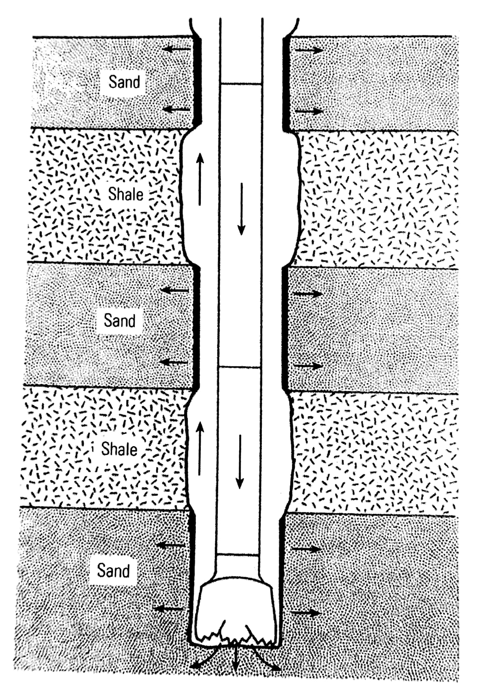
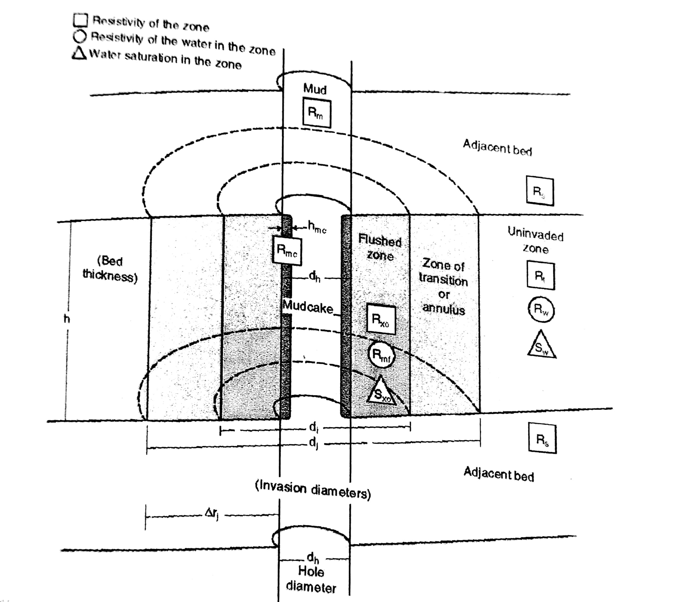

# Spontaneous Potential and Basic Resistivity

## Este notebook visa esclarecer todos os pontos teóricos referentes à técnica do potencial espontâneo em dados de well logging. 

## Uma breve introdução sobre o ambiente de poço

 O ambiente do poço é o resultado de um distúrbio mecânico induzido nas formações rochosas. Essas formações encontram-se ao redor do poço e tem suas propriedades físicas medidas. 
 
 Genericamente as profundidades de poços variam entre 304,8 e 7.000,00 metros, com diâmetros de 0,127 até 0,381 metros. Contudo, poços com valores maiores de profunidade e diâmetro podem existir. Um poço vertical em terra raramente terá devios maiores do que 5°. No mar, esses desvios podem variar entre 20° e 60°. A temperaturas em média variam entre 37,78°C e 148,89°C dependendo do gradiente geotérmico da região. 
 
 Na realização do furo é utilizada para fins de lubrificação do engenho a lama de perfuração. Tal lama possui densidade variando entre 9 e 16 lb/gal e utiliza aditivos de barita (BaSO4) ou hematita para garantir que a pressão hidroestática exceda a pressão do flúido presente nas formações, evitando o colapso do poço. A salinidade da lama varia entre 1.000 a 200.000 ppm de NaCl. Uma pressão positiva gerada pelo furo e pela lama de perfuração causam invasão em formações porosas e permeáveis. 
 
 Os primeiros momentos da perfuração ocorre um fenômeno conhecido como um surto de perda de formação. Isso é causado pela inicial penetração do flúido de perfuração e posterior parada deste processo através do acúmulo partículas de argila presente na lama de perfuração. A figura da esquerda ilustra o processo.  

## Referências online:
  É importante olhar esses sítios eletrônicos.

- [Well-Logging overview](http://www.pacificsurveys.com/01.htm)
- [BDEP](http://www.anp.gov.br/wwwanp/exploracao-e-producao-de-oleo-e-gas/dados-tecnicos?view=default)
- [IODP project](https://www.iodp.org/)

## Referências Bibliográficas:

- Ellis, D. V. and Singer, J. M., Well Logging for Earth Scientists, 2nd Edition, Springer, 2008. 

- Pirson, J. S., Geologic Well Log Analysis, Houston, Texas, Gulf Publishing Company, ISBN 0-87201-901-2, 1970.
#Potencial-Espontaneo-
